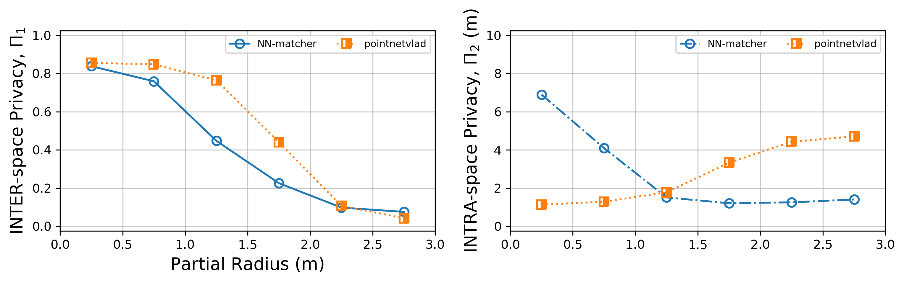
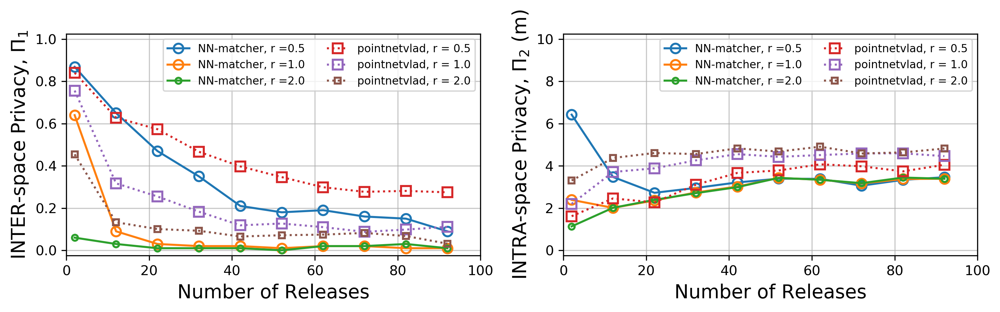

# 3D Spatial Privacy

[Background](#background)

[Sample Code](#sample-code)

[Dataset](#dataset)

# BACKGROUND
<p align="center">
  
  <br>
  <b>Figure 1:</b> A generic information flow for a desired MR functionality G with an attacker J which can perform adversarial inference off line to determine the space the user is in as well as the objects within the space: (1) adversarial inference modeling or learning from, say, historical 3D data, and (2) adversarial inference or matching over currently released 3D data<br>
</p>

<p align="center">
  
  <br>
  <b>Figure 2:</b> Inserting an intermediate privacy-preserving mechanism M which aims to prevent spatial inference<br>
</p>

AR/MR platforms such as [Google ARCore](https://developers.google.com/ar/), [Apple ARKit](https://developer.apple.com/documentation/arkit), and [Windows Mixed Reality API](https://www.microsoft.com/en-au/windows/windows-mixed-reality) requires spatial understanding of the user environment in order to deliver virtual augmentations that seemingly inhabit the real world, and, in some immersive examples, even interact with physical objects. The captured spatial information is stored digitally as a spatial map or graph of 3D points, called a *point cloud*, which is accompanied by mesh information to indicate how the points, when connected, represent surfaces and other structures in the user environment. However, these 3D spatial maps that may contain sensitive information can be stored and accessed by a potential adversary (as shown in Fig. 1), and be further utilized for functionalities beyond the application's intended function such as aggressive localized advertisements. And, so far, there are *no* mechanisms in place that ensure user data privacy in MR platforms.

In light of this, first, we present an attacker that not only recognizes the general space, i.e. *inter-space*, but also infers the user’s location within the space, i.e. *intra-space*. To construct the attacker, we build up on existing place and shape recognition methods that have been applied on 3D lidar data and modify it to the scale on which 3D data is captured by MR platforms. We demonstrate how easy it is to extend these 3D recognition methods to be used as an attacker in the MR scenario. Then, we present *spatial plane generalizations* with *conservative plane releasing* as a simple privacy approach which we insert as an intermediary layer of protection as shown in Fig. 2. For the attackers, we employed two different methods: NN-matcher which uses a *intrinsic* 3D descriptor matching, and the *deep neural network*-based [pointnetvlad](https://github.com/mikacuy/pointnetvlad).

Results show that revealing no more than 11 *generalized* planes--accumulated from revealed spaces with large enough radius, i.e. *r*≤1.0m--can make an adversary fail in identifying the spatial location of the user for at least half of the time. Furthermore, if the accumulated spaces are of smaller radius, i.e. *r*≤ 0.5m, we can release up to 29 generalized planes while enjoying both better data utility and privacy.

An e-print of this work is available [here](https://arxiv.org/abs/2004.08029):
```
@misc{guzman2020conservative,
    title={Conservative Plane Releasing for Spatial Privacy Protection in Mixed Reality},
    author={Jaybie A. de Guzman and Kanchana Thilakarathna and Aruna Seneviratne},
    year={2020},
    eprint={2004.08029},
    archivePrefix={arXiv},
    primaryClass={cs.CV}
}
```
While a subsequent published work is available [here](https://doi.org/10.1145/3448103)"
```
@article{10.1145/3448103,
author = {Guzman, Jaybie Agullo de and Seneviratne, Aruna and Thilakarathna, Kanchana},
title = {Unravelling Spatial Privacy Risks of Mobile Mixed Reality Data},
year = {2021},
issue_date = {March 2021},
publisher = {Association for Computing Machinery},
address = {New York, NY, USA},
volume = {5},
number = {1},
url = {https://doi.org/10.1145/3448103},
doi = {10.1145/3448103},
abstract = {Previously, 3D data---particularly, spatial data---have primarily been utilized in
the field of geo-spatial analyses, or robot navigation (e.g. self-automated cars)
as 3D representations of geographical or terrain data (usually extracted from lidar).
Now, with the increasing user adoption of augmented, mixed, and virtual reality (AR/MR/VR;
we collectively refer to as MR) technology on user mobile devices, spatial data has
become more ubiquitous. However, this ubiquity also opens up a new threat vector for
adversaries: aside from the traditional forms of mobile media such as images and video,
spatial data poses additional and, potentially, latent risks to users of AR/MR/VR.
Thus, in this work, we analyse MR spatial data using various spatial complexity metrics---including
a cosine similarity-based, and a Euclidean distance-based metric---as heuristic or
empirical measures that can signify the inference risk a captured space has. To demonstrate
the risk, we utilise 3D shape recognition and classification algorithms for spatial
inference attacks over various 3D spatial data captured using mobile MR platforms:
i.e. Microsoft HoloLens, and Android with Google ARCore. Our experimental evaluation
and investigation shows that the cosine similarity-based metric is a good spatial
complexity measure of captured 3D spatial maps and can be utilised as an indicator
of spatial inference risk.},
journal = {Proc. ACM Interact. Mob. Wearable Ubiquitous Technol.},
month = mar,
articleno = {14},
numpages = {26},
keywords = {object detection, and resource sharing, mixed or augmented reality, privacy}
}
```

# SAMPLE CODE

Pre-requisites
* Python
* Numpy
* Pandas
* Scipy, scikit-learn
* HDF5
* Bz2

Pre-requisites for DNN-based pointnetVLAD
* tensorflow

Sample generalized data is available [here](https://drive.google.com/drive/folders/1IMVuLJxuKeV9HchGY1Wet5IabK2NS4hc) (Download and unpack the ZIP files). Put the ransac_pc directory outside of this cloned repo. Then, put the unzipped (pre-trained) model directory inside this repo.


The notebook [00-generate-samples-and-submaps.ipynb](https://github.com/spatial-privacy/3d-spatial-privacy/blob/master/00-generate-samples-and-submaps.ipynb) generates the samples given the provided raw point clouds and generalized pointclouds. The notebook [01-one-time-partials-with-nn-matcher.ipynb](https://github.com/spatial-privacy/3d-spatial-privacy/blob/master/01-one-time-partials-with-nn-matcher.ipynb) contains a step-by-step replication of the validation and testing using the NN-matcher over one-time released partial spaces but with only 300 sample iterations (you can change this value). It uses prepared sample data for various scenarios. Similary, the notebook [02-successive-with-nn-matcher.ipynb](https://github.com/spatial-privacy/3d-spatial-privacy/blob/master/02-successive-with-nn-matcher.ipynb) shows spatial inference using the NN-matcher over successively released generalized partial spaces. While the notebook [03-inference-with-pointnetvlad.ipynb](https://github.com/spatial-privacy/3d-spatial-privacy/blob/master/03-inference-with-pointnetvlad.ipynb) shows spatial inference using the pointnetvlad for both one-time and successively released generalized partial spaces. It also plots the pointnetvlad performance against the NN-matcher.

Overall, we vary the following parameters on both Raw spaces and [RANSAC] generalized spaces: 
1. the size, i.e radius, of the revealed space
2. the number of successively released partial spaces
3. the number of *generalized* planes released

## Manual to [00-generate-samples-and-submaps](https://github.com/spatial-privacy/3d-spatial-privacy/blob/master/00-generate-samples-and-submaps.ipynb)

Step 0.1: Extracting sample points for one-time partial radius

Step 0.2: Creating a synthetic set of successive partial spaces

Step 0.3: Create submaps for pointnetvlad using same samples
Step 0.3.1: Generate the reference dataset using the raw dataset
Step 0.3.2: Generate a reference dataset using a sample (RANSAC) generalized dataset
Step 0.3.3: Generate the test submaps: for Raw spaces, for (RANSAC) generalized spaces, and for successive spaces.
Step 0.3.4: Building database and query files for evaluation with pointnetVLAD

## Manual to [01-one-time-partials-with-nn-matcher.ipynb](https://github.com/spatial-privacy/3d-spatial-privacy/blob/master/01-one-time-partials-with-nn-matcher.ipynb)

Step 1.1: Raw spaces (validation)

Step 1.2: RANSAC-generalized spaces validation

## Manual to [02-successive-with-nn-matcher.ipynb](https://github.com/spatial-privacy/3d-spatial-privacy/blob/master/02-successive-with-nn-matcher.ipynb)

Step 2.1: Successive case with generalized spaces

Step 2.2: Results of successive partial spaces.

## Manual to [03-inference-with-pointnetvlad.ipynb](https://github.com/spatial-privacy/3d-spatial-privacy/blob/master/03-inference-with-pointnetvlad.ipynb)

Step 3.1.1: One-time partial release case: inference using pointnetvlad
Step 3.1.2: Results: One-time release case with pointnetVLAD (vs NN-matcher)

Step 3.2.1: Successive case: spatial inference using pointnetvlad
Step 3.2.2: Results: Successive case with pointnetVLAD (vs NN-matcher)

## Sample results

<p align="center">
  
  <br>
  <b>Figure 3:</b> Average inter- and intra-space privacy of partial spaces with varying radius.<br>
</p>

<p align="center">
  
  <br>
  <b>Figure 4:</b> Average inter- and intra-space privacy of successively released partial spaces with increasing number of releases.<br>
</p>


# DATASET
<p align="center">
  
  <br>
  <b>Figure 5:</b> 3D point clouds of the 7 collected environments (left); a 3D surface of a sample space (bottom-right), and its 2D-RGB view (top-right)<br>
</p>

For our dataset, we gathered real 3D point cloud data using the Microsoft HoloLens in various environments to demonstrate the leakage from actual human-scale spaces in which an MR device is usually used. As shown in Fig. 5, our collected environments include the following spaces: a work space, a reception area, an office kitchen or pantry, an apartment, a drive way, a hall way, and a stair well.

# PROPOSED MECHANISM

<p align="center">
  
  <br>
  <b>Figure 6a:</b> Sample partial spaces of a bigger space<br>
    
  <br>
  <b>Figure 6b:</b> Generalizing the partial spaces<br>
    
  <br>
  <b>Figure 6c:</b> Conservative release of generalized planes<br>
</p>

In this work, we present *conservative plane releasing*, where we limit the number of planes a generalization produces. Fig. 6a shows an example set of planes that are released after RANSAC generalization of the revealed partial raw spaces (in Fig. 6b). Then, we can limit the maximum allowable planes that can be released, say, a maximum of 3 planes in total. As we can see in Fig. 6c, both partial releases produces only 3 planes.

# REFERENCE
Preliminary [work](https://doi.org/10.1007/978-3-030-29959-0_8) on NN-matcher:
```
@inproceedings{deguzman2019firstlook,
  title={A First Look into Privacy Leakage in 3D Mixed Reality Data},
  author={de Guzman, Jaybie A and Thilakarathna, Kanchana and Seneviratne, Aruna},
  booktitle={European Symposium on Research in Computer Security},
  pages={149--169},
  year={2019},
  organization={Springer}
}
```
